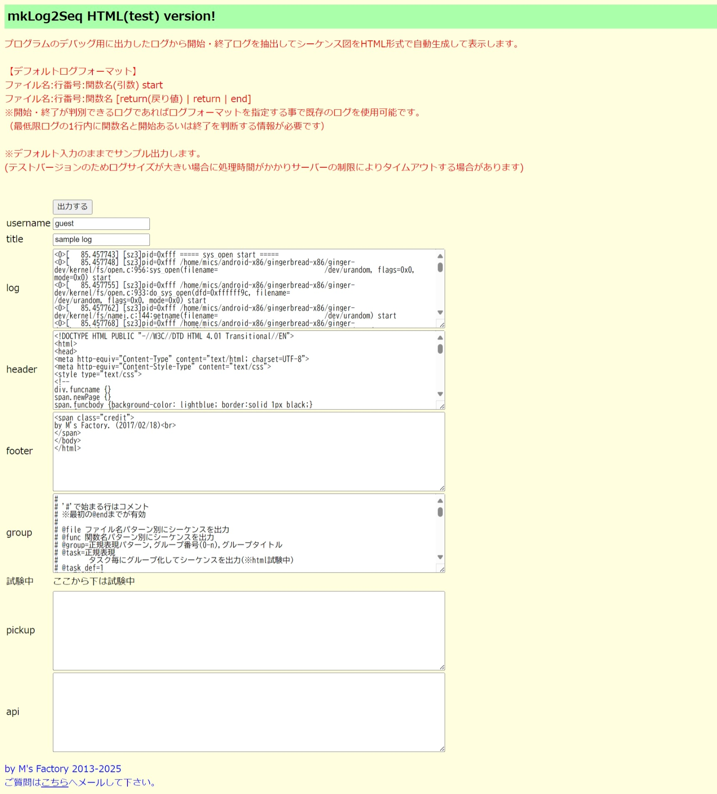
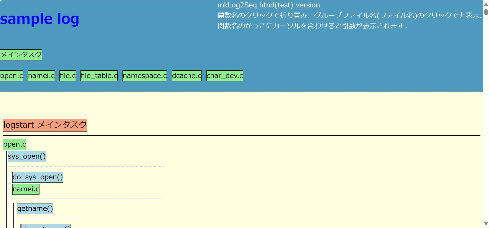

# mklog2seq

ログから HTML ベースのシーケンス図を生成する PHP ツールです。  
`start` / `return` / `end` 形式のログを解析し、関数呼び出しの流れをブラウザ上でたためるシーケンス表示に変換します。



## 概要

- フロント画面は `index.php` です
- 実際の変換処理は `mklog2seq.php` が担当します
- 初期表示時に `log.txt` `header.txt` `footer.txt` `group.txt` をフォームへ読み込みます
- 生成結果は別ファイルへ保存せず、そのまま HTML をレスポンスとして返します
- アクセス数を `count.txt` に加算します

## できること

- 開始ログと終了ログから関数の入れ子構造を可視化
- ファイル名または関数名ベースでグループ分け
- タスク単位での分離表示
- API として扱いたい関数名の強調
- 生成後 HTML 上での折りたたみ表示

## 画面構成

`index.php` には次の入力欄があります。

- `username`: 出力に付与するユーザー名
- `title`: シーケンス図タイトル
- `log`: 解析対象ログ
- `header`: 出力 HTML の先頭テンプレート
- `footer`: 出力 HTML の末尾テンプレート
- `group`: グループ定義
- `pickup`: 特定関数以降だけを解析したい場合のトリガー
- `api`: 強調表示したい関数名

## 動作要件

- PHP が動作する Web サーバー
- `count.txt` への書き込み権限
- ブラウザ

依存ライブラリは同梱の `jquery.min.js` のみです。

## ローカル起動例

PHP のビルトインサーバーで動かす場合:

```powershell
php -S 127.0.0.1:8000
```

起動後に `http://127.0.0.1:8000/index.php` を開きます。

公開環境での動作確認先:
`https://www.mics-soft.jp/autolog/mklog2seq/`

## 基本的な使い方

1. `index.php` を開く
2. `log` に解析したいログを貼り付ける
3. 必要なら `header` `footer` `group` `pickup` `api` を調整する
4. `出力する` を押す
5. 生成された HTML シーケンス図をブラウザで確認する

## デフォルトのログ形式

開始ログ:

```text
ファイル名:行番号:関数名(引数) start
```

終了ログ:

```text
ファイル名:行番号:関数名 return
ファイル名:行番号:関数名 return(戻り値)
ファイル名:行番号:関数名 end
```

実装上は `block-start` `block-end` `break` にも対応しています。

## `group.txt` の設定

`group.txt` では、ログの正規表現とグループ分け方法を指定できます。

主な指定:

- `@func_start=...`: 開始ログの正規表現
- `@func_start_def=...`: 正規表現の各キャプチャをどの項目として使うか
- `@func_return=...`: 終了ログの正規表現
- `@func_return_def=...`: 終了ログ側の項目定義
- `@file`: ファイル名ベースでグループ分け
- `@func`: 関数名ベースでグループ分け
- `@group=正規表現,番号,表示名`: グループ定義
- `@task=正規表現`: タスク抽出
- `@end`: 定義終端

同梱の `group.txt` には複数のサンプルが入っています。

## テンプレートファイル

- `header.txt`: 生成 HTML の `<head>` 相当。CSS と jQuery を含みます
- `footer.txt`: 生成 HTML の末尾
- `log.txt`: サンプルログ
- `group.txt`: ログ解析とグループ分けの定義

## 出力 HTML の操作

生成後の画面では以下の操作ができます。

- 関数名クリック: 子呼び出しの折りたたみ
- タスク名クリック: タスク単位の表示切替
- グループ名クリック: グループ単位の表示切替
- 関数のツールチップ: 元ログの行情報表示

## 現状の注意点

- 大きいログは処理時間が長くなり、サーバー設定次第でタイムアウトする可能性があります
- `mklog2seq.php` はアクセス時に `count.txt` を更新するため、読み取り専用環境では失敗します
- 現状の実装では `mklog2seq.php` 側の POST 受け取り名が `grouop` になっており、画面の `group` 入力が反映されない可能性があります
- エラー処理関数 `error()` は実質未実装のため、異常系は HTML 上の警告表示が中心です

## ファイル一覧

- `index.php`: 入力フォームと紹介ページ
- `mklog2seq.php`: ログ解析と HTML 生成本体
- `header.txt`: 出力ヘッダー
- `footer.txt`: 出力フッター
- `group.txt`: グループ定義とログ形式定義
- `log.txt`: サンプルログ
- `count.txt`: アクセスカウンタ
- `スクリーンショット.jpg`: 入力画面例
- `出力例.jpg`: 出力イメージ

## 出力例


